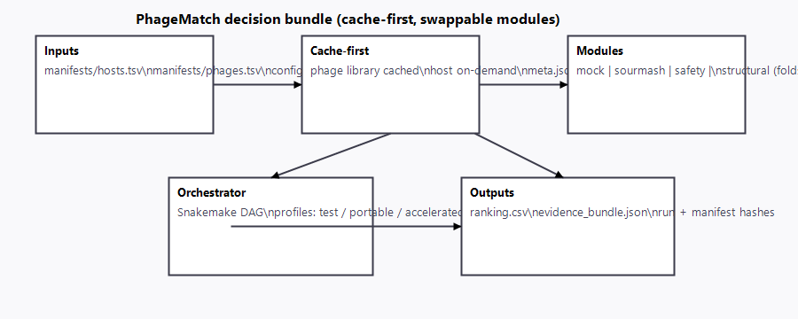

# PhageMatch (v0.1) — mockable pipeline with locked contracts

PhageMatch is a **decision-support pipeline stub**: given a host isolate and a phage library, it produces a **ranked shortlist** plus an **audit-friendly evidence bundle**. v0.1 is intentionally minimal but engineered to show how the “real” modules will plug in without changing contracts.

- **Single demo command:** `snakemake -s Snakefile --configfile config.yaml --cores 1`
- **Outputs:** `results/runs/H001/ranking.csv` and `results/runs/H001/evidence_bundle.json` (also pre-generated in `demo_outputs/H001/`)
- **Profiles:** `test` (fully mocked), `portable` (sequence-only), `accelerated` (structure + safety planned)

## Quick start

Prereqs: `conda` (for Snakemake/optional tool envs) and `snakemake>=7`.

Mock/demo (deterministic, tiny data already committed):
```bash
snakemake -s Snakefile --configfile config.yaml --cores 1
```

Inspect without running:
- `demo_outputs/H001/ranking.csv`
- `demo_outputs/H001/evidence_bundle.json`
- `demo_outputs/H001/test_plan.md`

Browser viewer (zero build):
- Run: `powershell -ExecutionPolicy Bypass -File .\run_demo.ps1`
- This runs the pipeline (unless `-DemoOnly`), starts a tiny local server, and opens `viewer/index.html` to display the decision bundle (defaults to demo pack; falls back automatically if results are missing). Fallback to `file://` is used only if the server cannot start.

Small real-data dry-run (sequence-only):
1) Add your phage FASTAs to `manifests/phages.tsv` and host FASTA/FAA to `manifests/hosts.tsv`.
2) Set in `config.yaml`: `modules.test_mode: false`, `modules.enable_sourmash: true`, `modules.enable_safety: false` (until plugged in), `modules.enable_structural_ppi: false`.
3) Run:
```bash
snakemake -s Snakefile --configfile config.yaml --cores 4 --use-conda
```
This will compute sourmash containment and emit the same `ranking.csv` + `evidence_bundle.json` contract.

## What the outputs look like (excerpt)

**ranking.csv**
```csv
host_id,phage_id,rank,confidence_score,primary_reason,safety_flags
H001,P001,1,0.92,mock_structural_support,none
H001,P002,2,0.61,mock_sequence_similarity,possible_temperate
```

**evidence_bundle.json** (shape)
```json
{
  "pipeline_version": "0.1.0",
  "run_id": "ISO-8601",
  "mock": true,
  "config_hash": "...",
  "manifest_hashes": {"phages": "...", "hosts": "..."},
  "snapshots": {"modules": {...}, "params": {...}, "versions": {...}},
  "features": {
    "sourmash": {
      "status": "ok|skipped",
      "source": "real|mock",
      "metric": "containment",
      "tool": "sourmash",
      "tool_version": "4.x",
      "reason": null
    }
  }
}
```

## Repo layout (clean surface area)
- 
- `Snakefile` → delegates to `workflow/pm_v0_1/Snakefile`
- `config.yaml` → baseline config (toggle modules here)
- `profiles/` → suggested module toggles (`test`, `portable`, `accelerated`)
- `manifests/` → TSV contracts for inputs
- `data/inputs/` and `data/library/` → tiny demo FASTA/FAA files
- `demo_outputs/` → committed ranking/evidence/test-plan for H001
- `docs/architecture/01–05_*.md` → overview, profiles, cache/versioning, feature contracts, output contract
- `PITCH.md`, `ROADMAP.md` → narrative + milestone plan

## Contracts and standards
- **Inputs:** `manifests/phages.tsv` (`phage_id`, `fasta`), `manifests/hosts.tsv` (`host_id`, `genome_fna`, `proteome_faa`).
- **Outputs:** `results/runs/{host_id}/ranking.csv` + `evidence_bundle.json` (schemas in `docs/architecture/05_output_contract.md`).
- **Profiles:** `test` (fully mocked), `portable` (real sourmash, no GPU), `accelerated` (planned: foldseek/colabfold + safety).
- **Cache-first:** phage library cached; host processed on demand; tool/db versions recorded.
- **Swapability:** real modules must honor the feature/output schemas; mocks can be swapped for real implementations without changing downstream consumption.
- **Auditability:** config + manifest hashes stored; run is reproducible from the committed demo data.

## Running with real data (idealized path)
1) Populate manifests with your FASTAs/FAAs.
2) Set `modules.test_mode: false`; enable modules you have dependencies for.
3) Install envs as needed (e.g., `conda env create -f envs/sourmash.yml` then `snakemake ... --use-conda`).
4) Point `databases` paths in `config.yaml` when you plug in safety/structural modules.
5) Keep `results/` and `cache/` out of git (already ignored).

## Why this stub is “investor-clean”
- Minimal surface area (no personal docs, tiny committed data).
- Locked contracts and demo outputs that run deterministically.
- Clear upgrade path in `ROADMAP.md` and module toggles in `config.yaml`.
- Evidence bundle and ranking schema already mimic a regulated pipeline.

## Not medical advice
This is a software prototype. Wet-lab validation and clinical governance remain the source of truth.
